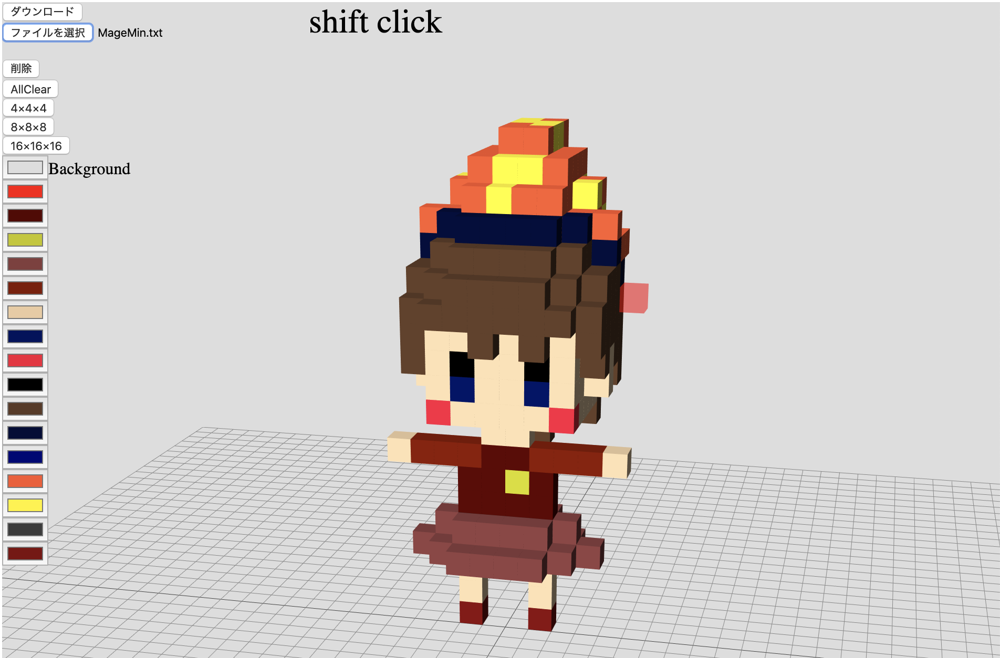

# voxel-editor

Web上でVoxelの編集が出来るサービスを作ろうと思っています。  
## 現状
カメラの回転が出来る  
色が変更出来る  
ファイルの読み書きが出来る
## 次の課題
undo/redoの実装  
キューブの透過度を有効にする  
他のユーザの作品を共有する  
## contributors 募集
一緒に作っていただける方を募集します。  
使い心地をためしてIssuesに起票していただけるだけでも、ありがたいです。

## ビルド

主なnpm run script.

- npm start

  ライブリロードしながら開発できます.

- npm run build|build:stg|build:prd

  各開発環境別にビルドできます

- npm run lint|lint:fix

  lint

